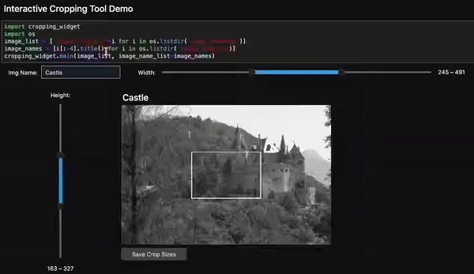

# jupyter-interactive-cropping-widget
An interactive widget to rapidly crop images in Jupyter notebooks.



This widget can be found on the PyPI repository [here]('').

## Build Instructions
### Install Jupyter and enable ipywidgets
After cloning this repo, you can build the widget from source and use in a jupyter lab/notebook instance. Before this widget will work properly, you will need to [install and enable jupyter widgets](https://ipywidgets.readthedocs.io/en/stable/user_install.html). To enable the widgets for *Jupyter Lab* using pip follow the below commands

```
pip install jupyterlab #installs jupyter lab and gives access to jupyter lab CLI
pip install ipywidgets
jupyter nbextension enable --py widgetsnbextension
jupyter labextension install @jupyter-widgets/jupyterlab-manager
```
\* Feel free to run this in your default python environment or a separate kernel; If using a separate kernel make sure it has been added to the available kernels via the `ipykernels` package

### Installing requirements for this widget
Once Jupyter has been installed and enabled, check that all requirements have been downloaded by running `pip install -r requirements.txt` from this directory. Then, open up a jupyter lab instance by running `jupyter lab`, and once inside try the below example using the images in the `sample_image` directory:

```python
from cropping_widget import main as crop
import os
image_list = ['image_samples/'+i for i in os.listdir('image_samples')]
crop(image_list)
```
For further examples of cropper use, see the `Examples.ipynb`.
